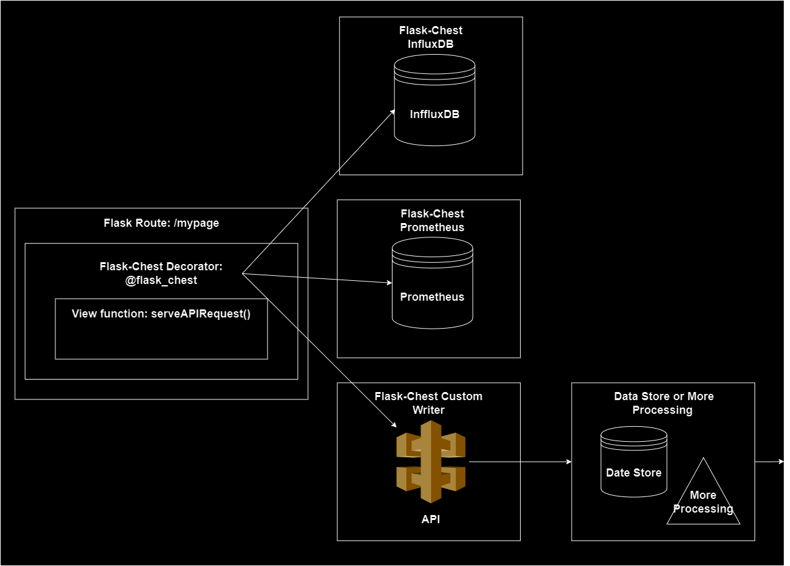

<!-- Import custom.css -->
<link rel="stylesheet" type="text/css" href="_static/custom.css">

# Sample Usage

## Example: Exporting SLIs to Multiple Targets
Suppose you have a Flask app that is serving an API, and you want to report on [Service Level Indicators](https://sre.google/sre-book/service-level-objectives/) (SLIs) to both an <u>InfluxDB 2.x instance</u> and <u>[SignalFX](https://www.splunk.com/en_us/about-splunk/acquisitions/signalfx.html)</u>. For this example, your SLIs are <b>total transactions</b> and <b>average response time of POST requests</b> to a single API endpoint. You want to track these SLIs for each request made to the API, and export them to both backends, so that you can <u>monitor and analyze the performance of your API in real-time</u>.<br>

<center>
<figure>

<figcaption>Fig 1: Multi-target data flow diagram showing how data is exported from the view function of a Flask route to multiple backends using the `Flask-Chest` package.</figcaption>
</figure>
</center><br>

This example uses the following `FlaskChest` objects:
- `FlaskChestInfluxDB`, to establish a connection to an InfluxDB 2.x instance and write data points to a specified bucket.
- `FlaskChestCustomWriter`, to post data points to a SignalFX endpoint over HTTP.

As well as the `flask_chest` decorator to track global context variables and write data points to the specified backends.

## Imports
First you must import `FlaskChestInfluxDB`, `FlaskChestCustomWriter`, and the `flask_chest` decorator from the `flask-chest`package.

```python
from flask_chest import FlaskChestCustomWriter, FlaskChestInfluxDB
from flask_chest.decorator import flask_chest
```

Then you must initialize each chest object with their respective parameters.

## FlaskChestInfluxDB
Our `FlaskChestInfluxDB` will write data points to an InfluxDB 2.x database running on `http://localhost:8086` with the provided authentication token. The data points are written to the `my-bucket` bucket in the `my-org` organization, and custom tags are added to each data point. We are also passing a global logging object, so that our logs are written to the same place as the rest of our Flask app,

```python
chest_influxdb = FlaskChestInfluxDB(
    name="InfluxDB"
    url="http://localhost:8086",
    token=os.getenv("INFLUXDB_TOKEN"),
    org="my-org",
    bucket="my-bucket",
    custom_tags={"app": "your-app-name"},
    logger=logger,
)
```
## FlaskChestCustomWriter
Then we must initialize our `FlaskChestCustomWriter` object, which will post data points to an endpoint listening on `http://localhost:3000`. To create an instance of `FlaskChestCustomWriter`, we must write a function that will return a data payload when passed the context tuple list.

Here is a simple payload generator that returns a dictionary mapping the index of each 3-tuple in the list of 3-tuples, to the 3-tuple itself.
```python
def cust_payload_generator(context_tuple_list: List[Tuple[str, Any, str]]):
    payload = {}
    for i, context_tuple in enumerate(context_tuple_list):
        payload[i] = context_tuple
    return payload
```

We then initialize the `FlaskChestCustomWriter` object, passing this function as the `payload_generator` parameter. This object logs all messages using the provided logger instance, does not verify the server's TLS certificate, considers HTTP status codes `200` and `201` as success, does not send any headers or URL parameters with the POST request, does not use any proxies, uses our custom payload generator function, and posts data points to an endpoint listening on `http://localhost:3000`.

```python
chest_custom_writer = FlaskChestCustomWriter(
    name="CustomWriter",
    url="http://localhost:3000",
    payload_generator=cust_payload_generator,
    verify=False,
    success_status_codes=[200, 201],
    logger=logger,
)
```

## `flask_chest` Decorator
Now that the Flask Chest objects are initialized, we can apply our `flask_chest` decorator to our desired Flask route to start exporting. For this example app, lets use the following simple Flask index route,

```python
@app.route("/", methods=["GET", "POST"])
def index():
    g.start = time.time()
    if request.method == "POST":
        g.user_id = "123"
        g.total_time = time.time() - g.start
        return "Hello, World!"
    g.user_id = "321"
    g.total_time = time.time() - g.start
    return "Hello, World!"
```

The `flask_chest` decorator takes a dictionary mapping HTTP request methods to a list of global context variables that should be tracked during that request context. If we wanted to export the `g.total_time` for both `GET` and `POST` request methods, but only the `g.user_id` for `POST` requests, we would define our tracked variables map as so,

```python
route_tracked_vars = {
    "GET": ["user_id", "total_time"],
    "POST": ["total_time"],
}
```

Another optional parameter we can provide the `flask_chest` decorator is a `request_id_generator`. This function will get execute every time a request is made to the route. For this example, we will use the current date and time as formatted string to distinguish requests made to the route.

```python
def custom_request_id_generator():
    now = datetime.now()
    return now.strftime("%Y%m%d%H%M%S%f")
```

With our Flask Chest objects, our tracked variables dictionary, and our `request_id_generator` function initialized, we can now apply the `flask_chest` decorator to our index route like so,

```python
@app.route("/", methods=["GET", "POST"])
@flask_chest(
    chests=[chest_influxdb, chest_custom_writer],
    tracked_vars=route_tracked_vars,
    request_id_generator=custom_request_id_generator,
)
def index():
    g.start = time.time()
    if request.method == "POST":
        g.user_id = "123"
        g.total_time = time.time() - g.start
        return "Hello, World!"
    g.user_id = "321"
    g.total_time = time.time() - g.start
    return "Hello, World!"
```